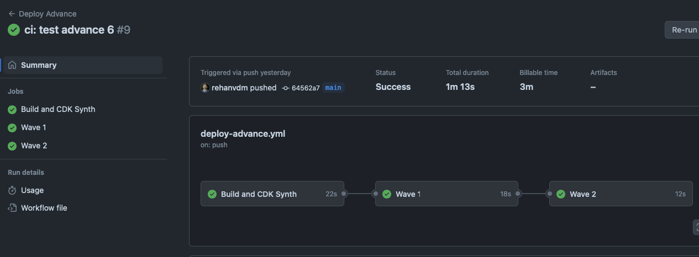
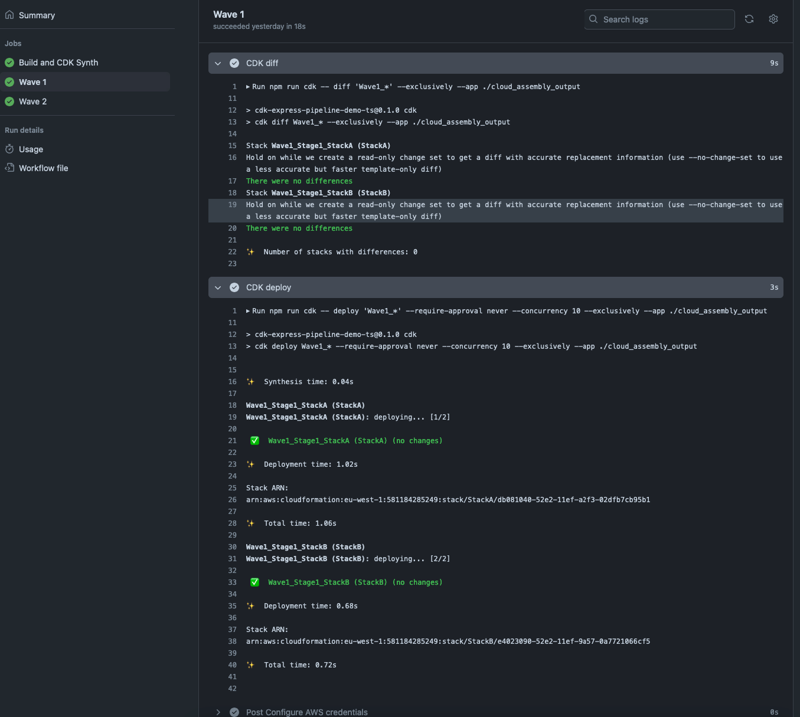

# CDK Express Pipeline Demo TS

This is a demo project for the [CDK Express Pipeline](https://github.com/rehanvdm/cdk-express-pipeline) showcasing
how to use the library in a TypeScript project. This pipeline has the following structure:

```plaintext
🌊 Waves  - Deployed sequentially
🔲 Stages - Deployed in parallel, all stages within a wave are deployed at the same time
📄 Stack  - Dependency driven, will be deployed after all its dependent stacks, denoted by ↳ below it, is deployed

🌊 Wave1
  🔲 Stage1
    📄 StackA (Wave1_Stage1_StackA)
    📄 StackB (Wave1_Stage1_StackB)
        ↳ StackA
🌊 Wave2
  🔲 Stage1
    📄 StackC (Wave2_Stage1_StackC)
```

It is a standard CDK TypeScript project that has GitHub workflows and some extra NPM scripts to diff and deploy locally.

## GitHub Workflows

The project has the following GitHub workflows, below are screenshots of the Action logs (as they expire over time):

### `diff.yml`

Does a build and CDK Diff on PR open and push, the `cdk diff` output can be viewed in the action run logs.


### `deploy.yml`

Does a build, CDK Diff and Deploy when a push happens on the `main` branch.


### `deploy-advance.yml`

The `synth` job builds the CDK app and saves the cloud assembly to the `./cloud_assembly_output` directory. The whole
repo with installed NPM packages and the cloud assembly is then cached. This job of the pipeline does not have access
to any AWS Secrets, the installing of packages and building is decoupled from the deployment improving security.

The `wave1` and `wave2` jobs fetch the cloud assembly from the cache and then do a CDK Diff and Deploy on only their
stacks. The `wave1` job targets all the stacks that start with `Wave1_` and the `wave2` job targets all the stacks that
start with `Wave2_`. It is important to add the `--exclusively` flag to only focus on the specified stacks and not their
dependencies.



